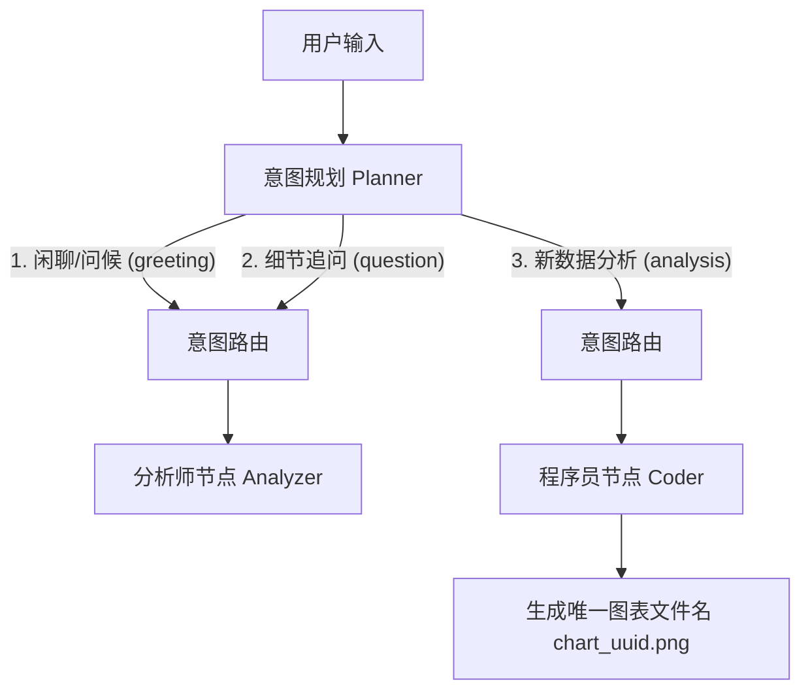

# 优化记忆系统与智能路由：彻底消除多轮对话重复绘图及图表覆盖

在当前的设计中，存在两个影响多轮对话体验的严重缺陷：
1. **历史图表覆盖缺陷**：Coder 生成的代码始终将图表保存到固定路径（如 `daily_transaction_amount.png`）。后续生成新图表时会覆盖该文件，导致浏览器渲染历史消息时全都显示最新的图表（即看起来所有历史消息都是重复相同的图表）。
2. **意图路由重复缺陷**：Planner 只有 `analysis` 和 `greeting` 两类意图。用户在生成分析报告后询问细节（如“为什么周六数据低”），会被 Planner 划为 `analysis`，再次触发 Coder 生成代码和重新绘图，导致不断在对话历史中插入重复且无用的图表和报告。

---

## 💡 方案设计与改进路径

### 1. 动态生成唯一图表文件名
修改 `core/agent.py` 中 `coder_node` 的提示词规范：
* 强制要求 Coder 在生成的 Python 代码中导入 `uuid`。
* 强制将图表保存文件名改为动态随机格式，如：`f"./data/outputs/chart_{uuid.uuid4().hex[:8]}.png"`。
* 这样可以确保多次生成的图片路径完全独立，历史对话记录中的图片标签不会被覆盖。

### 2. 细化 Planner 意图分类与动态路由
重构 `core/agent.py` 中的 `planner_node`、`intent_router` 与 `analyzer_node`：
* **Planner 意图升级为三分类**：
  * `greeting`: 简单问候与闲聊。
  * `question`: 用户针对已生成的分析报告、图表内容、编写的 Python 代码进行追问、解释或细节提问（如“刚才的代码是什么原理”、“为什么周末交易低”）。
  * `analysis`: 用户提出了新的数据处理、分析、绘图、计算等硬活需求，需要编写新代码并运行。
* **路由器流转优化**：
  * `question` 与 `greeting` 路由直接流向 `analyzer_node`，跳过 `coder_node` 与 `executor_node`，避免重复执行代码。
* **分析总结员（Analyzer）提示词动态化**：
  * 在 `analyzer_node` 中检查最新的 `<内部路由标签>`。
  * 如果是 `question` 或 `greeting`，采用**答疑解惑型提示词**，直接根据历史上下文耐心地回答用户问题，不重新撰写带有“核心摘要、核心指标、建议措施”等格式的完整商业报告。
  * 如果是全新的 `analysis`，才采用原有的**商业报告撰写提示词**。

---

## Proposed Changes

### [智能体大脑] (core)

#### [MODIFY] [agent.py](file:///d:/Rag/DataViz_Agent/core/agent.py)
* 修改 `coder_node` 内的 system prompt，加入动态生成唯一图片名 (`uuid`) 的指令约束。
* 修改 `planner_node` 内的 system prompt，升级分类模型为 `greeting`、`question` 和 `analysis` 三分类。
* 修改 `intent_router` 路由函数，使得 `question` 和 `greeting` 直接流转至 `analyzer_node`。
* 修改 `analyzer_node`，在函数头部回溯 state 消息历史寻找最新的 `<内部路由标签>`，并根据不同的意图匹配对应的 System 提示词（如果是 `question`，则使用轻量级专业解答提示词；如果是 `analysis`，则使用完整商业分析提示词）。

---

## Verification Plan

### 自动化验证与功能回归
1. 运行 `test_agent.py` 回归测试，确保图的编译与正常运行无误。
2. 启动前端 `web_app.py` 和后端 `main.py` 进行交互调试。

### 手动交互测试用例
* **步骤 1**：上传一个数据文件，发送：“分析一下数据并绘制图表”。系统应触发 `analysis` 流程，成功画图并撰写报告。
* **步骤 2**：追问细节：“为什么周六的交易额这么低？”。系统应当流向 `question` 路径（控制台打印：`只是闲聊或针对历史提问，直接交由分析员回复`），直接基于上下文解答，**不触发 Coder，不生成新图片，不生成新的空白商业报告**。
* **步骤 3**：再次发起新 analysis：“请帮我画一个饼图展示比例”。系统应当再次流向 `analysis` 路径，生成全新的图表，且**之前的柱状图和历史记录不被覆盖破坏**。
