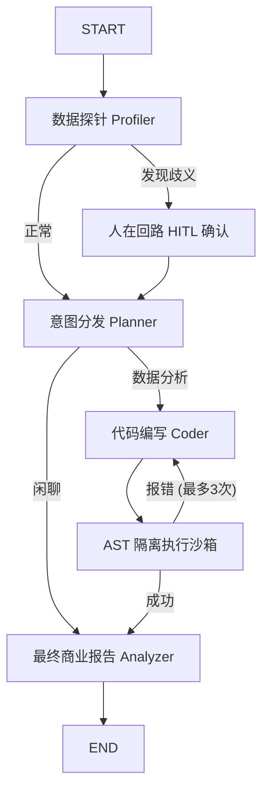

#  DataViz Agent: Enterprise Autonomous Data Analyst


DataViz Agent 是一个专为中小企业设计的**工业级自动化数据可视化智能体**。
有别于传统的对话机器人，本系统不仅能够理解用户意图，更能够在高度隔离的安全沙箱中自动编写、纠错、执行 Python 数据分析代码，并将生成的分析报告与图表通过 SSE 协议实时流式推送到前端。

---

##  核心特性 (Core Features)

*   **🧠 智能冷热模型路由 (LLM Factory)**
    *   通过前置的 `Planner` 节点低成本极速识别用户意图。
    *   简单的闲聊直接放行，复杂的分析任务路由至旗舰推理大模型（Core LLM），实现成本与性能的极致平衡。
*   **️ AST 级别安全沙箱 (Security Sandbox)**
    *   采用 `ast.NodeVisitor` 进行深度语法树扫描，在代码编译前精准拦截危险模块（如 `os`, `sys`, `subprocess` 等）。
    *   支持目录快照机制（Directory Snapshotting），精准捕获运行期间产生的文件资产。
*   ** 自我反思与修复闭环 (Reflexion)**
    *   依托 LangGraph 的状态机，若沙箱执行报错，系统将自动抓取底层 `traceback` 堆栈，携带错误日志打回给大模型进行重试纠错，无需人类干预。
*   **✋ 人在回路设计 (Human-in-the-Loop)**
    *   内置数据探针（Profiler）节点。当系统检测到表头歧义、大规模缺失值或乱码时，通过 `interrupt_before` 触发系统冻结。
    *   在取得人类干预授权与纠偏后，系统方可解冻并继续流转，严格保障生产环境数据的准确性。
*   ** 工业级双轨 SSE 推流 (Dual-track Streaming)**
    *   通过底层的 `astream_events` 回调拦截机制，向前端并发推送**Token打字流**与**底层节点执行状态 (Status)**。打破传统 Agent 运行时的黑盒体验。

---

## 🏗️ 架构设计 (Architecture)

系统采用 LangGraph 状态机编排复杂的工作流：



---

##  快速启动 (Quickstart)

### 1. 环境准备
```bash
# 激活虚拟环境 (可选)
python -m venv .venv
source .venv/bin/activate  # Windows: .venv\Scripts\activate

# 安装依赖
pip install -r requirements.txt
```

### 2. 配置环境变量
在项目根目录创建 `.env` 文件，填入你的大模型 API Key（默认兼容智谱/OpenAI格式）：
```env
OPENAI_API_KEY=your_api_key_here
BASE_URL=https://open.bigmodel.cn/api/paas/v4/
```

### 3. 启动前后端服务
**终端 1：启动 FastAPI 高性能后端引擎**
```bash
uvicorn main:app --reload
```

**终端 2：启动 Streamlit 交互式前端**
```bash
streamlit run web_app.py
```

打开浏览器访问 `http://localhost:8501`，上传一份 CSV 文件，即刻体验自动化数据分析！

---

## 🛠️ 技术栈清单
- **核心框架**: LangChain, LangGraph, FastAPI, Pydantic
- **大模型生态**: OpenAI API 标准协议 (兼容 Qwen, GLM 等)
- **数据处理引擎**: Pandas, Matplotlib, Seaborn
- **交互与网络**: Streamlit, Server-Sent Events (SSE)
